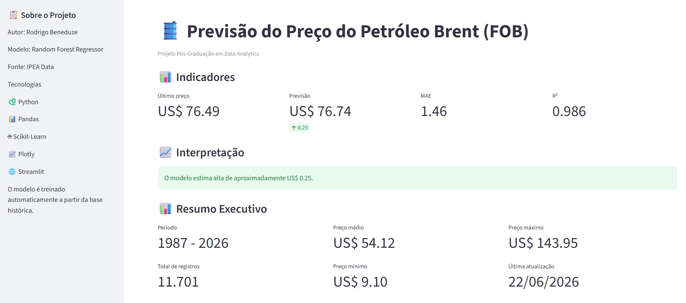
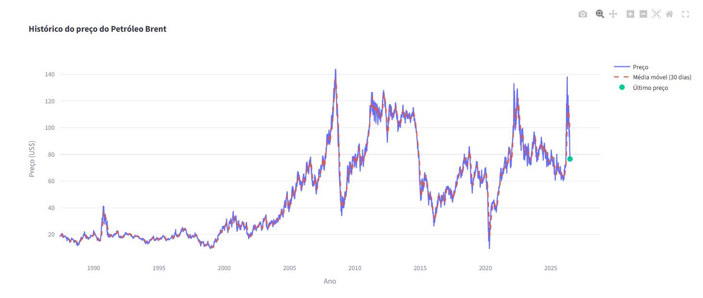
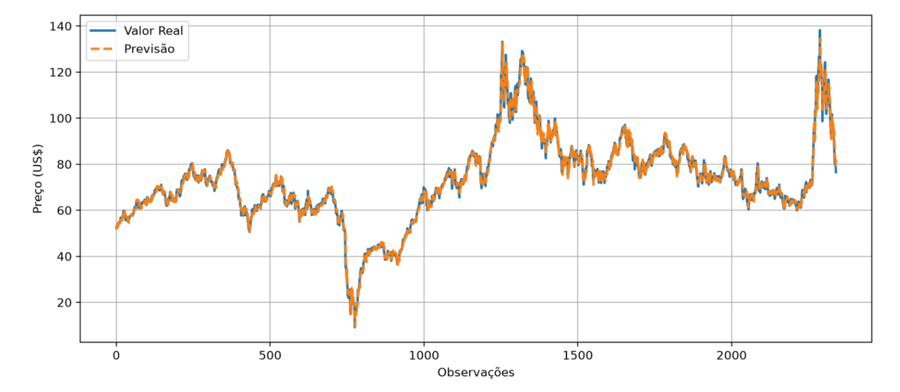
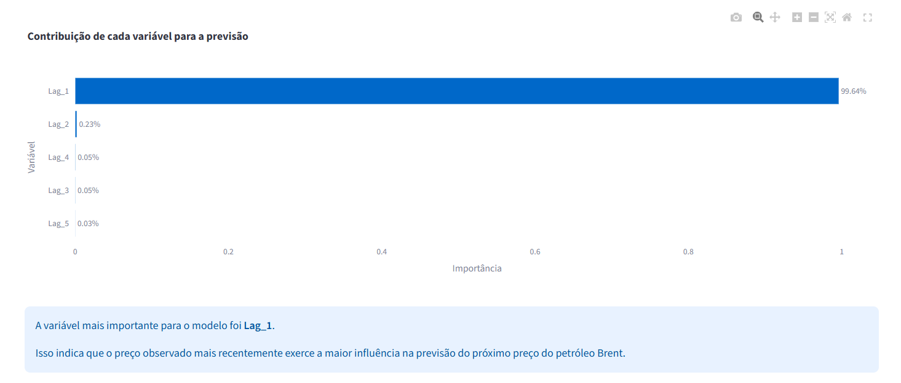
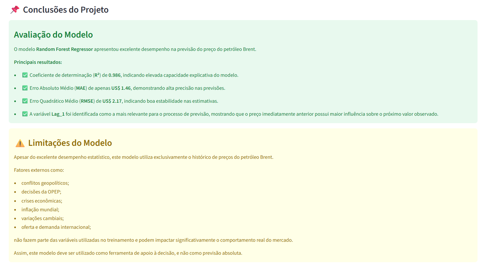

<p align="center">
  
</p>

# 📊 Previsão do Preço do Petróleo Brent (FOB)

Aplicação desenvolvida em **Python** utilizando técnicas de **Machine Learning** para prever o próximo preço diário do petróleo Brent (FOB), com base em dados históricos disponibilizados pelo **IPEA Data**.

O projeto contempla todas as etapas de um pipeline de Ciência de Dados, desde a coleta e tratamento dos dados até o treinamento do modelo, avaliação dos resultados e disponibilização de um **Dashboard Interativo** utilizando Streamlit.


---

# 🚀 Demonstração

## Aplicação Online

👉 https://SEU-LINK-STREAMLIT.streamlit.app

O dashboard permite:

- 📈 Visualizar o histórico completo do petróleo Brent
- 🤖 Prever automaticamente o próximo preço
- 📊 Comparar valores reais e previstos
- 📉 Analisar a importância das variáveis
- 📥 Baixar a base utilizada
- 📋 Consultar indicadores do modelo

---

# 🎯 Objetivo

Desenvolver um modelo de Machine Learning capaz de prever o próximo preço diário do petróleo Brent (FOB), utilizando dados históricos disponibilizados pelo IPEA Data.

Além da modelagem preditiva, o projeto demonstra todas as etapas de um pipeline de Ciência de Dados e disponibiliza os resultados por meio de uma aplicação web interativa desenvolvida em Streamlit.

---

# 🏗 Arquitetura da Solução

O projeto segue um pipeline completo de Ciência de Dados.

<p align="center">

</p>

---

# 📸 Dashboard

## 🏠 Tela Inicial

<p align="center">

</p>

Exibe:

- Indicadores do modelo
- Previsão automática
- Resumo executivo
- Interpretação dos resultados

---

## 📈 Histórico do Preço

<p align="center">

</p>

Permite analisar toda a série histórica do petróleo Brent entre 1987 e 2026.

---

## 📊 Comparação entre Valores Reais e Previstos

<p align="center">

</p>

Compara visualmente as previsões realizadas pelo modelo com os valores observados.

---

## 🧠 Importância das Variáveis

<p align="center">

</p>

Mostra a contribuição de cada variável utilizada na previsão.

---

## ⚙️ Pipeline de Machine Learning

<p align="center">

</p>

Explica todas as etapas do processo:

- Coleta dos dados
- Tratamento
- Engenharia de atributos
- Treinamento
- Avaliação
- Predição

---

## ✅ Conclusões do Modelo

<p align="center">

</p>

Apresenta:

- Avaliação do desempenho
- Indicadores obtidos
- Limitações do modelo
- Considerações finais

---

# 💻 Tecnologias Utilizadas

- Python
- Pandas
- NumPy
- Scikit-Learn
- Random Forest Regressor
- Plotly
- Streamlit
- GitHub

---

# 🗄 Fonte dos Dados

Fonte:

**IPEA Data**

Histórico diário do preço do petróleo Brent (FOB).

Período analisado:

**1987 a 2026**

Total de registros:

**11.701**

---

# 🔄 Pipeline do Projeto

O projeto foi desenvolvido seguindo o fluxo clássico de Ciência de Dados.

1. Coleta dos dados
2. Tratamento dos dados
3. Engenharia de atributos
4. Treinamento do modelo
5. Avaliação
6. Predição automática

---

# 📈 Indicadores Obtidos

| Indicador | Resultado |
|-----------|-----------|
| MAE | **1.46** |
| RMSE | **2.17** |
| R² | **0.986** |

Os resultados demonstram elevada capacidade preditiva do modelo.

---

# ✅ Principais Funcionalidades

- Dashboard Interativo
- KPIs Executivos
- Previsão automática
- Comparação entre valores reais e previstos
- Histórico completo do petróleo
- Média móvel
- Importância das variáveis
- Interpretação automática
- Download da base em CSV

---

# 📂 Estrutura do Projeto

```text
Projeto_Final_Petroleo.ipynb
app.py
BASE.xlsx
requirements.txt
README.md
banner.png

dashboard-home.png
dashboard-historico.png
dashboard-comparacao.png
dashboard-variaveis.png
dashboard-metodologia.png
dashboard-conclusao.png
```

---

# ⚙ Como executar localmente

Clone o projeto

```bash
git clone https://github.com/rodrigobeneduze/projeto-final-petroleo.git
```

Instale as dependências

```bash
pip install -r requirements.txt
```

Execute

```bash
streamlit run app.py
```

---

# 📌 Considerações Finais

O modelo Random Forest apresentou excelente desempenho na previsão do preço diário do petróleo Brent, alcançando um **R² de 0,986**, explicando aproximadamente **98,6% da variabilidade dos dados históricos**.

Os baixos valores de **MAE (US$ 1,46)** e **RMSE (US$ 2,17)** demonstram elevada precisão das estimativas.

Embora apresente excelente desempenho estatístico, fatores externos como conflitos geopolíticos, decisões da OPEP, crises econômicas e eventos internacionais não fazem parte das variáveis utilizadas, devendo o modelo ser interpretado como uma ferramenta de apoio à decisão.

---

# 👨‍💻 Autor

**Rodrigo Beneduze**

Pós-Graduação em Data Analytics — FIAP

2026

